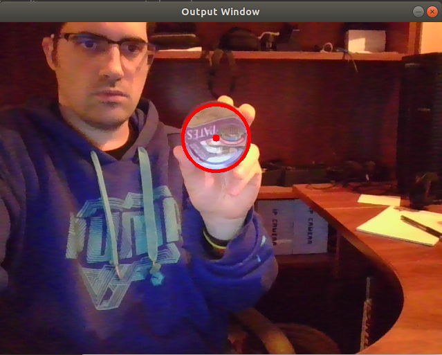

# webcam_circleis
##Circle detection from online webcam images

The image below show that a bottle is detected like a circle.

##The parameters of the circle detector are:

const int GAUSSIAN_BLUR_SIZE = 7;
double const GAUSSIAN_BLUR_SIGMA = 2;
double const CANNY_EDGE_TH = 150;
double const HOUGH_ACCUM_RESOLUTION = 2;
const double MIN_CIRCLE_DIST = 100;
double const HOUGH_ACCUM_TH = 80;
const int MIN_RADIUS = 20;
const int MAX_RADIUS = 70;

Of these parameters the main ones would be MIN_RADIUS and MAX_RADIUS. These parameters directly affect the size of the circles that are detected, if these parameters are not well configured, the circle we need to detect may not be detected due to their size (always in pixels).

The next parameter that affects considerably would be the MIN_CIRCLE_DIST, this parameter corresponds to the minimum distance between the centers of the circles. In case of choosing a very small value, the device will detect a large number of false circles.

Another parameter that is important in detection is HOUGH_ACCUM_RESOLUTION. This parameter defines the accuracy of the device detection. Reducing this value will cause a large number of detected circles even in ways far from a circle. On the contrary, a very high resolution will cause only one circle to be detected when the device sees a perfect circle (which can cause it to never be detected if the resolution of the device is not very high).

The parameter CANNY_EDGE_TH is a parameter for the Canny algorithm used by the function HoughCircles () to detect edges in the original images. It is the parameter that controls the threshold of the edge detector.

Finally we have the HOUGH_ACCUM_TH parameter which is the Threshold of the accumulator to decide the detection of the center of the circle. Reducing this value can cause the detection of a large number of false circles.

##Hough transform

The Hough transform convert points in the xy space to lines in the mc space. 

You taken an edge detected image, and for every point that is non black, you draw lines in the mc place, some lines will intersect. These intersections mark are the parameters of the line.

## Sources:

http://wiki.ros.org/op3_ball_detector

https://en.wikipedia.org/wiki/Canny_edge_detector

https://es.wikipedia.org/wiki/Transformada_de_Hough
